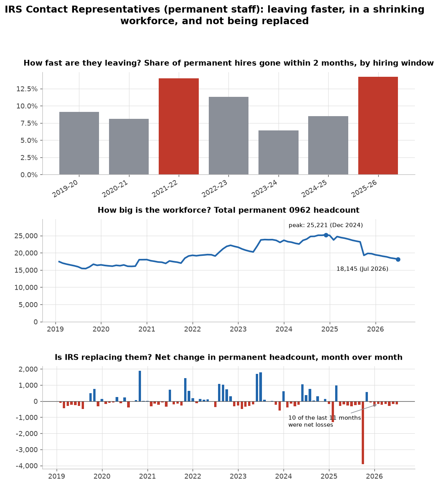
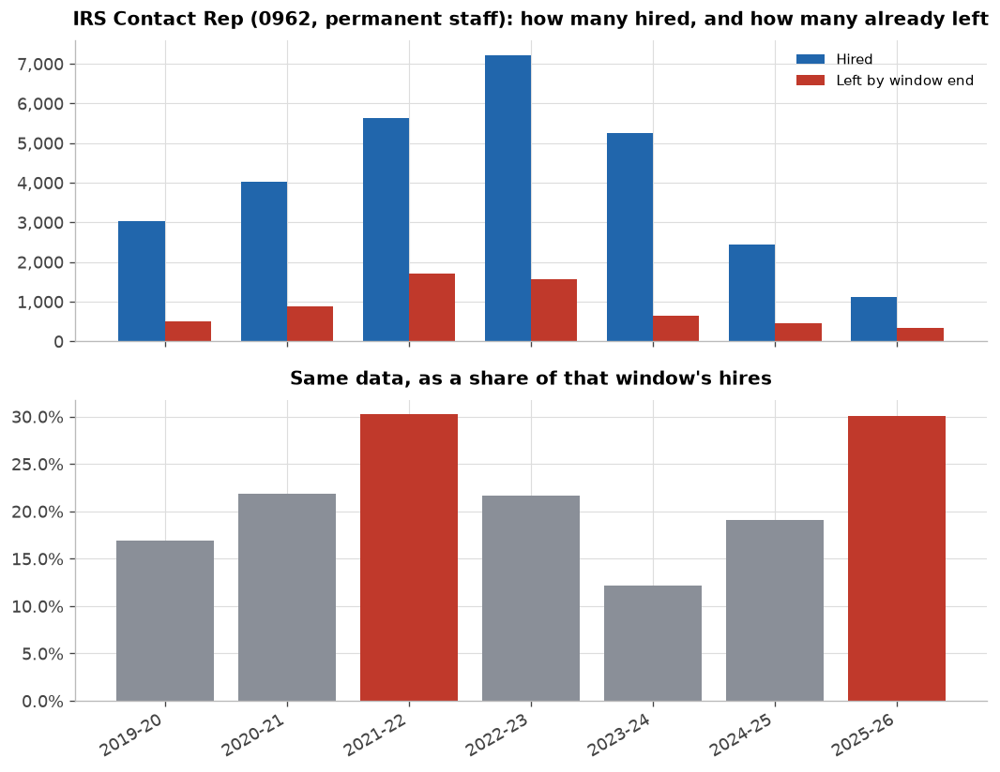

# Is ICE's rookie-attrition problem happening anywhere else?

**Analyst memo · data through Jul 2026 · every figure reproduced in `attrition_screen.ipynb`**

**Bottom line.** Mostly no, with one real exception. FBI shows no rookie-attrition signal — its
September 2025 spike was a buyout-driven exodus of 22-year veterans, not new hires washing out. A
government-wide screen finds nothing else at ICE's scale — except **IRS Contact
Representatives**, essentially the only job IRS still hires for. They quit almost as fast as
ICE's surge officers. That speed isn't a record for this job, but it's doubled in two years, and
IRS has stopped replacing them — a workforce hollowing out for years, not a sudden 2025 shift.

**Source.** OPM/EHRI records, read directly from `impactproject/opm-ehri-data`. Companion to the
sibling `icehires` repo, which found ICE's pattern first.

---

### 1. Does `length_of_service_years` mean "just hired"? · *notebook §1*
Checked against FBI new hires: 84.6% show 0 years, 85.5% under a year — the field works. Two
failure modes had to be fixed first: seasonal workforces (Forest Service, Census, IRS filing
season) look like extreme "attrition" when unfiltered; and even filtered to permanent
appointments, a stock-based rate (separations ÷ current under-1-year headcount) explodes for any
agency that just stops hiring. Fix: an **implied-hire-month correction** — back out each
departure's hire month from its tenure at separation, and only count it against a window if the
person was actually hired in it. Same cohort logic `icehires` uses for ICE, generalized.

### 2. FBI: a real shock, not a hiring problem · *notebook §2*
Headcount fell 349 in two months after September 2025, but under-1-year separations stayed flat
(0-5/month) the whole time. The spike: 332 separations, 75% DRP-flagged (Deferred Resignation
Program, the 2025 buyout), average tenure 21.8 years, 78% with 20+ years in. A veteran exodus, not
rookies washing out.

### 3. A government-wide screen, corrected · *notebook §3*
Every agency, hires and departures counted in the same window, departures matched to hire vintage.
Sorted by level, TSA looks alarming (~18%) but hasn't moved; Defense Commissary Agency actually
improved. Sorted by **change** — the only fair read — exactly two agencies combine real hiring
volume with a genuinely worse rate: **ICE (+13pp, 4.3%→17.5%)** and **IRS (+8pp, 21.0%→28.9%)**.

### 4. IRS: what's happening · *notebook §4*
IRS froze hiring everywhere except **Contact Representatives** (call-center staff, series 0962) —
92% of all IRS hiring since September. Of 1,108 hired, **333 (30.1%) already left**, 88% a plain
voluntary quit.

### 5. The headline: leaving faster, shrinking, not replaced · *notebook §4*
None of these three is a record alone. Together, right now, they are:
- **Faster:** quit-within-2-months rate climbed for three years — 6.4% (2023-24) → 8.5% (2024-25)
  → 14.2% (2025-26) — back to the 2021-22 peak (14.0%).
- **Shrinking:** headcount peaked at 25,221 (Dec 2024), down 28% to 18,145 (Jul 2026).
- **Not replaced:** net headcount change negative 10 of the last 11 months.

{width=6in}

Under-1-year employees were 32% of the workforce at the 2022 peak; today, 3%.

{width=6in}

---

### What the data can't say · *notebook §1, §4*
- **No person IDs.** The implied-hire-month correction infers hire vintage from tenure at
  departure; it isn't confirmed individual tracking.
- **Agency-level rates dilute.** ICE's all-series rate (17.5%) is far below its
  enforcement-officer rate (`icehires`, ~28-33%) since non-enforcement hiring is stickier. Treat
  agency-level numbers as screening signals, not final claims.
- **Neither IRS number is a record.** The new thing is the multi-year collapse in fresh hires and
  the sustained net losses, not the exit rate alone.

*Reproduce: `python src/extract.py`, then run `attrition_screen.ipynb`. Paths and logic in `src/lib.py`.*
